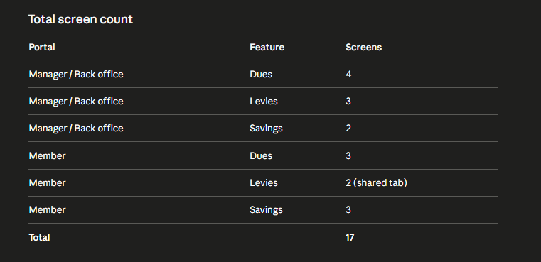

# V02 FRONTEND Specifications — Dues, Levies, Savings

The screen inventory

## Dues Feature

### Back office / Manager portal

1. Dues list page — table of all dues set up for the cooperative. Columns: name, amount, cycle, status (active/inactive), priority, next run date. Inline toggle to activate/deactivate. Button to create new due.
2. Create due — setup form — name, amount, cycle (monthly/weekly/custom), deduction date, start date, which treasury wallet receives it, priority level. Option to skip a cycle.
3. Due detail page — top summary cards (total collected, total owing, cycles run, active members). Below that, a table of cycles — each row is one run (e.g. November 2024, December 2024). Shows total paid, unpaid, expected, member count per cycle.
4. Cycle detail page (drill-down) — you click a cycle row and see all members listed for that cycle. Each row: member name, amount expected, amount paid, status, date paid. Action buttons: manual override (mark as paid), send reminder.
   That's 4 screens for dues on manager/back office.

### Member portal

5. Dues home tab — list of all dues the member is enrolled in. Each card shows: due name, amount, next due date, status (paid/unpaid this cycle). If unpaid, a "Pay now" CTA.
6. Due payment confirmation screen — simple confirmation before deducting from wallet. Shows: due name, amount, wallet to be debited, balance after. Confirm button.
7. Due history screen — all past dues payments for a specific due. Table: cycle, amount, date paid, status.
   That's 3 screens for dues on member portal.

## Levies Feature

### Back office / Manager portal

8. Levies list page — table of all levies. Columns: name, amount, deadline, members affected, total collected, status. Actions: view, mark all complete.
9. Create levy form — name, amount, deadline, select members (all or subset), which treasury wallet receives it.
10. Levy detail page — top summary cards (total expected, total collected, outstanding, deadline countdown). Below: a single table showing all members — paid rows and unpaid rows together. Member name, amount, date paid (or "pending"), status.
    That's 3 screens for levies on manager/back office.

### Member portal

11. Levies section on member portal — list of open levies the member is expected to pay. Card per levy: name, amount, deadline, status. Pay now CTA if outstanding.
12. Levy payment confirmation — same pattern as dues confirmation. Name, amount, wallet debited, balance after.
    Levies can share the dues tab on the member portal — same tab, different section heading. Or a combined "Payments" tab. No need for a separate nav item.

## Savings Feature

### Member portal

13. Savings home screen — list of all the member's savings plans. Card per plan: name, type (goal/generic/locked), current balance, progress bar if goal-based, lock end date if locked.
14. Create savings plan — setup flow — step 1: choose type (goal, generic, locked). Step 2: name, description, target amount (if goal), lock duration (if locked), which wallet holds it. Step 3: confirmation.
15. Savings plan detail page — for goal savings: progress bar, amount saved, target, projected completion date. For locked savings: amount locked, interest rate, maturity date, projected payout. For generic: just balance and transaction history.
    That's 3 screens for savings on member portal.

### Manager / Back office portal

16. Savings monitoring page — table of all members and their savings plans. Filter by type. Summary cards at top: total savings pool, number of active plans, total locked.
17. Member savings detail — view a specific member's savings plan. Same view as the member sees, but read-only. Option to create a plan on behalf of a member.

Total screen count
PortalFeatureScreensManager / Back officeDues4Manager / Back officeLevies3Manager / Back officeSavings2MemberDues3MemberLevies2 (shared tab)MemberSavings3Total17

