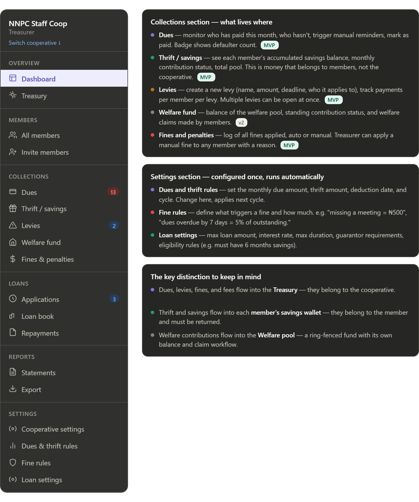

# DASHBOARD FEATURES AND DUES COLLECTION FEATURE

In this phase we are describing the different features that will be on the dashboard and on how the dashboards will look.

## DASHBOARD

We have 3 portals and each portal has a different look and feel.

\_Back Office Portal Dashboard is your common dashboard with sidebar, topbar and a display. It has summary page, coperative, loans, dues and etc. We will populate the sidebar as features are added.
\_Manager Portal Dashboard is also any common dashboard with sidebar, topbar and a display. It has summary page, coperative, loans, dues and etc. We will populate the sidebar as features are added. 
\_Member Portal Dashboard is NOT really a dashboard. It's more like a mobile app but running on web. We have a mini menu bar at the bottom that shows the most important menu items like Home, Wallet, Loas, etc. Then it has a top bar that shows the current coperative the member is viewing. And etc. It's less a dashbaord and more a mini app. It even has it's hamburger to pull out a more comprehensive menu. Even if viewd on desktop, it still very much has a mobile phoen feel to it. Max width of about 380px to 410px.

## 1. Dues Setup and Tracking (Recurring payments that go to a Treasury account.)

A manager/back office admin can setup recurring payment and trackers for a coperative. This is simply a feature that allows them to setup collection of monthly/weekly dues or any reocurring dues that they want to be collecting. They choose the wallet to receive the dues, choose the start date and the reoccurence and etc. They can even name it. They can decide to skip a monthly due and etc.

### A. Setup (on Back Office/Manager portal)

i. Set Collection Cycle
ii. Set Deduction Date
iii. Set Amount (Fixed amount)
iv. what else might be needed to set?
v. Name of Due
vi. set which Treasury Cooperative wallet the due should go to.

### B. Operational Monitoring View (on Back Office/Manager)

i. see list of all dues that have been setup. Be able to activate/deactivate it on the table view. (Managers can create multiple dues and each must have a priority level)
ii. Due details page, where you can now see breakdown of total fees collected for that due, total owing, total cycles the due has run, (all these show on cards. like a summary)
iii. Due details page, a table showing the cycles that have run in a table list. so if we have monthly dues setup, after 6 months, we will see 6 different rows(1 per row). ANd each will show total paid, unpaid, owing, total expected, total count of members expected to pay, etc.
iv. From the table in iii, we can now get them to click on one of the cycles showing, and then we show a member due detail table where we see all members listed out. showing how much each paid as due, basically, it's a transaction list for all the members for that cycle run of the due. action buttons to manual override (mark as paid if someone pays cash), and an auto-reminder trigger.

## 2. Levies setup and Tracking (fines/fees that members pay from thier wallet to a Treasury Account)

Created on demand. The treasurer/manager clicks "Create new levy," gives it a name, amount, deadline, and selects which members it applies to (all, or a subset or even just 1 or 2).

### A. Setup (on Back Office/Manager portal)

i. create a new levy (name, amount, deadline, members who it applies to),
ii. Multiple levies can be open at once
iii. set which cooperative wallet account should receive the funds.

### B. Operational Monitoring View (on Back Office/Manager)

i. view all levies created on a table. amount payable, deadline, count of members it applies to, actions like mark as actionable, mark as all completed
ii. view details of a levy. summary card at top. table of all expected transactions for the levy showing member, amount paid, date paid, etc. also showing memebrs who have not paid on the same table.
iii. a per-levy tracking view (who's paid, who hasn't, total collected vs total expected), basically same as ii above. => Levy Details
iv. view payments per member per levy.

## 3. Savings (NOT Thrift)

This is basically saving towards a goal or just saving in general.
The member's accumulated thrift is visible on their profile. Setup in Settings, monitoring on member profile.
Members will create their savings plan and then work towards it. backOffice admin and managers can then monitor via their own respective portals.
Consistently,, in the spirit of our rule, a back office admin or a manager can then help a member setup a savings plan (if the member requests).

### A. Setup (on Member portal)

i. Set savings type (save to a goal or just generic savings, or locked savings)
ii. Set Name, set description, set the wallet to be holding the savings (member wallet), member can have multiple wallets.
iii. set lock dration, calculate interest, etc.

### B. Operational Monitoring View (on Member Portal)

i. The member's accumulated thrift is visible on their profile.
ii. For "save to a goal", they can see the progress of their goal.
iii. For locked savings, they can see how much they will earn from the locked savings and duration of locking.

Note that Thrift means something different in Nigerian cooperatives.
