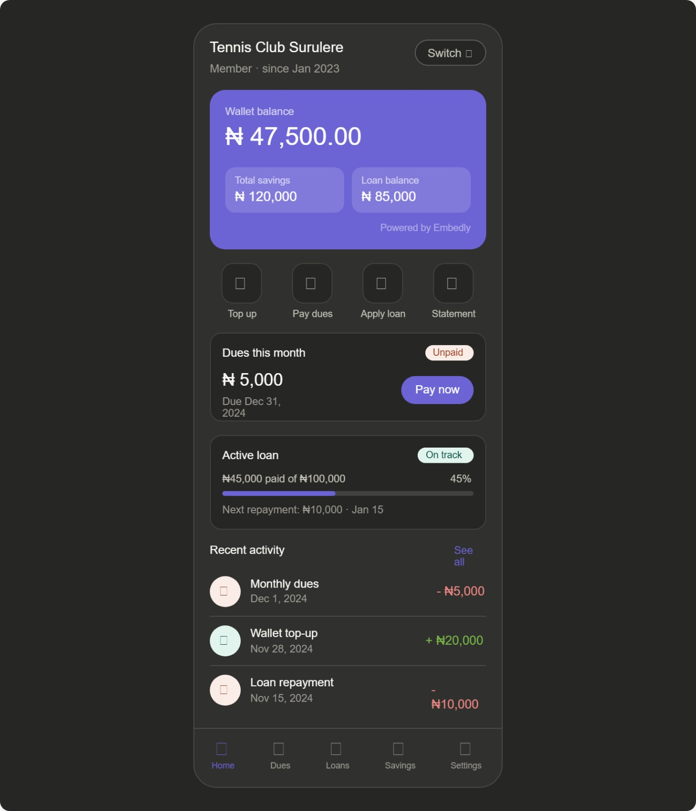

I want us to fully rework the member dashboard home page...
This covers both a FE and BE addition and updates.
The current UI is fine, we just need to touche it up a bit. The layout works. But the content on hthe dashboard page is what we want to change.

## 1. The top banner is fine but the member part should have a

"Member dot since Feb 2021" under the cooperative name.
Refer to screenshot.
this data can be returned per org that the member might switch to and saved on the FE context also.

## 2. The Wallet Card update.

I have added the card design image for you to reference.

project\sides\U01_MEBMER_DASHBOARD.jpeg

To get the wallet details like name, account number and bank name, you have to make an endpoint to the backend.
The endpoint to call does not exist meaning we have to create a endpoitn that takes member token and cooperative and uses it to fetch the wallet details from the database.
SELECT \* FROM `EmbedlyWallets` WHERE (`OwnerId` = '67108343-0e04-4abd-aa32-a4f93a8b046c') AND (`WalletType` = 'Member') AND (`CooperativeId` = 'ebb966df-ce61-4357-8e0f-32ab2aeb020f');
Now the bank is always Sterling Bank however the bank name will always be stored in an env on the back end server code.

For the balance, when the user clicks on the eye icon, we then fetch the wallet balance from embedly directly. See snippet of how back end is to do this...

```js
export async function getMemberWalletLive(
memberId: string,
cooperativeId: string,
accountNumber: string,
): Promise<unknown> {
logger.info(
{ memberId, accountNumber },
"Service: getSchoolWalletLiveForAdmin",
);

const walletRecord =
await embedlyWalletRepo.findEmbedlyWalletByOwnerIdAndAccountNumber(
schoolId,
accountNumber,
);
if (!walletRecord)
throw new NotFoundError("Wallet not found for this member in this corperative.");

const urlPath = `${env.embedly.urls.getWalletByAccountNumber}/${accountNumber}`;
const response = await embedlyRequest<{ data: unknown }>("GET", urlPath);
return response.data.data;
}
```

ensure that backend maintains the existing route => controller=> service => repository flow.
We also already have an embedly client for making api calls to embedly.

I have put sample tsx of the WalletCard design and flow.
Make sure to use our purple theme for the card. As this one uses another color.

```tsx
function WalletCard({
  schoolId,
  wallet,
}: {
  schoolId: string;
  wallet: SchoolWalletRecord;
}) {
  const navigate = useNavigate();
  const [live, setLive] = useState<SchoolWalletLive | null>(null);
  const [showBalance, setShowBalance] = useState(false);
  const [loadingBalance, setLoadingBalance] = useState(false);
  const [showWithdrawModal, setShowWithdrawModal] = useState(false);

  const handleEyeClick = async () => {
    if (showBalance) {
      setShowBalance(false);
      return;
    }
    if (live) {
      setShowBalance(true);
      return;
    }
    setLoadingBalance(true);
    try {
      const data = await getSchoolWalletLiveForSchool(
        schoolId,
        wallet.accountNumber,
      );
      setLive(data);
      setShowBalance(true);
    } catch {
      toast.error("Failed to fetch live balance.");
    } finally {
      setLoadingBalance(false);
    }
  };

  return (
    <>
      <div className="bg-gradient-to-r from-[#426af2] to-[#3458d5] rounded-[16px] p-6 text-white flex flex-col gap-4">
        <div className="flex items-center justify-between">
          <p className="font-['Albert_Sans',sans-serif] font-semibold text-[15px] opacity-90">
            {wallet.walletName ?? "Wallet"}
          </p>
          <button
            onClick={handleEyeClick}
            className="p-1.5 bg-white/20 rounded-[8px] hover:bg-white/30 transition-colors cursor-pointer"
          >
            {loadingBalance ? (
              <Loader2 size={16} className="animate-spin" />
            ) : showBalance ? (
              <EyeOff size={16} />
            ) : (
              <Eye size={16} />
            )}
          </button>
        </div>
        {showBalance && live ? (
          <p className="font-['Albert_Sans',sans-serif] font-bold text-[26px]">
            ₦
            {live.availableBalance.toLocaleString("en-NG", {
              minimumFractionDigits: 2,
            })}
          </p>
        ) : (
          <p className="font-['Albert_Sans',sans-serif] font-bold text-[26px] opacity-40">
            ₦ ••••••
          </p>
        )}
        <div className="space-y-1 text-[13px] opacity-80">
          <p>
            <span className="opacity-75">Account: </span>
            <span className="font-semibold">{wallet.accountNumber}</span>
          </p>
          {SHOW_BANK_NAME ? (
            <p>
              <span className="opacity-75">Bank: </span>
              <span className="font-semibold">Sterling Bank</span>
            </p>
          ) : (
            <p>
              <span className="opacity-75">Bank: </span>
              <span className="font-semibold">Provider Bank</span>
            </p>
          )}
        </div>
        <div className="flex gap-2">
          <button
            onClick={() =>
              navigate(
                `/acadify-admin/schools/${schoolId}/wallet-transactions/${wallet.accountNumber}`,
              )
            }
            className="flex-1 bg-white/10 text-white px-3 py-2 rounded-[8px] font-['Albert_Sans',sans-serif] font-semibold text-[12px] hover:bg-white/20 transition-colors border border-white/20 text-center cursor-pointer"
          >
            View Transactions
          </button>
        </div>
      </div>
    </>
  );
}
```

## 3. Quick Access Actions

Top up, Pay dues, Apply loan, Statement => gives the user something to do immediately without navigating anywhere. Most used actions, always one tap away.

a. Top Up (just opens a wallet details modal. modal has a qR Code that contains the account numer digits only. i.e generate a qr code that when scanned shows the a/c number in full), Show the 10-digit account number text, show the bank name

b. pay dues shows a coming soon

c. apply load shows a coming soon

d. statemement just opens a modal interface to allow user to select the details of his statement.

- he chooses if he wants csv or pdf
- he selects the date range
- he selects if he wants to send the file as an attachment to his or any email. (if he chooses this option, the file is generated and sent to the email of choice.)
- he clicks export button
  (we need to do the backend endpoint for this. the transaction details again are gotten from embedly, then the backend packages the transaction details into a pdf/csv accordingly and if need be, sends it via email or sends it back to the FE client depending on the selected option.)

the api call to embedly is detailed in the embedly wallet provider details.
server\project\WALLET_PROVIDER.md

## 4 Following Actions section

This section helps us track dues and loans if active.
bith can jsut say coming soon for nwo because we hav enot yet done loans and dues.

## 5. Recent Activity section

here just show the transaction hostory (most recent). with a see all button that takes you to the actual list of all.
This is also the get transactio hiostory from embedly. same thing we used for statment but this defaults to a 3month window call.

## HELPERS

- For all details of endpoint calls to Embedly, you can see it in the server\project\WALLET_PROVIDER.md
- lastly the width of the layout can be increased to 410px or 420px. but on mobile we maintian our 100% full screen.
