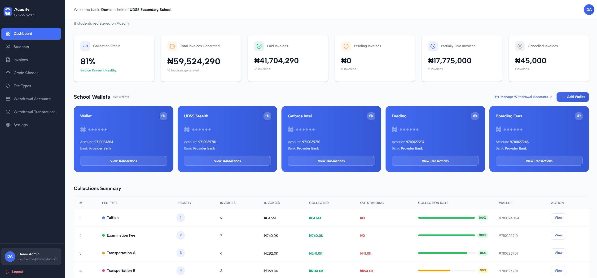

I want us to fully work the manager dashboard home page(ui route => http://localhost:5173/manager/dashboard)...
and the back office admin coperative detail dashboard.(ui route=> /admin/cooperatives/:cooperativeId/overview)
at least let's have a v1 of the dasboards home pages.
This covers both a FE and BE addition and updates.
The current UI is just sayig coming soon.
we just need to touche it up a bit. The layout works.

## Note

The app operates on the assumption that "everything a manager can do or see, the backoffice admin must be able to see and do the same thing from the back office." This creates a redundancy such that if a manager is not willing to carry out actions for him self, the back office admin can help easily.

## 1. Summary Section

This is where we show summary of this particular coperative.
They are just summary cards. Check the screen shot at 
total members, total managers, total number of coperative wallets, total number of loans(hardcode for now), total number of dues collected(hard code for now) These are the "vital signs" of the cooperative.

member count
SELECT count(\*) FROM `MemberUsersCooperatives` WHERE `CooperativeId` = 'ebb966df-ce61-4357-8e0f-32ab2aeb020f';

manager count
SELECT count(\*) FROM `ManagementUsersCooperatives` WHERE `CooperativeId` = 'ebb966df-ce61-4357-8e0f-32ab2aeb020f';

coperative wallets count
SELECT count(\*) FROM `EmbedlyWallets` WHERE (`WalletType` = 'Cooperative') AND (`CooperativeId` = 'ebb966df-ce61-4357-8e0f-32ab2aeb020f');

## 2. Wallets Overview Section

This is where we show all the wallets of the coperative in a card format. Again follow the view and card format used on the member dashboard. Only difference here is a coperative might have multiple wallets, hence multiple cards.
We need to create an endpoint for this. this endpoint checks our database and returns all wallet accoutn numbers for a coeprative.
SELECT \* FROM `EmbedlyWallets` WHERE (`WalletType` = 'Cooperative') AND (`CooperativeId` = 'ebb966df-ce61-4357-8e0f-32ab2aeb020f');
put the endpoitns in their respective routes (one for backeoffice and anotehr for manager)

Then for each to fetch the live balance (when the eye icon isclicked), we replicate what we did for the member wallet card. Use that card as a reference.
ensure that backend maintains the existing route => controller=> service => repository flow.

This section also has an Add Wallet BUtton. Clicking on this opens a modal where the person can input the name of the wallet that they want to create. Then endpoint is called to create wallet.we already have this endpoint. the endpoit basocally takes a name and publishes it to queue while the wallet creation happens in the background.
router.post(
"/:cooperativeId/create-wallet",
requireAdminPermission("CoopCooperativesWrite"),
controller.createCooperativeWallet,
);
this one is for back office admin,. Create a similar one for manager.

hence FE should just show a message saying "Coperative Wallet will be created in the backgroung, refresh in a few minuteas" or somethign like that so that the user is carried along.

For now, Coperative can have maximum of 5 wallets. add this in the env client and env server files accordingly so you can check and prevent them from creating more.

## 3. Continuous Actions Section (Dues on the left and levies on the right)

These are going to show summary of dues and levies. it's one section but 2 big sections that then hold smaller cards. It's a future addition. so for now coming soon.

## 4. Savinsg Summary Section (coming soon)

COming soon.

## 5. Coperative Loans Section (coming soon)

COming soon.
